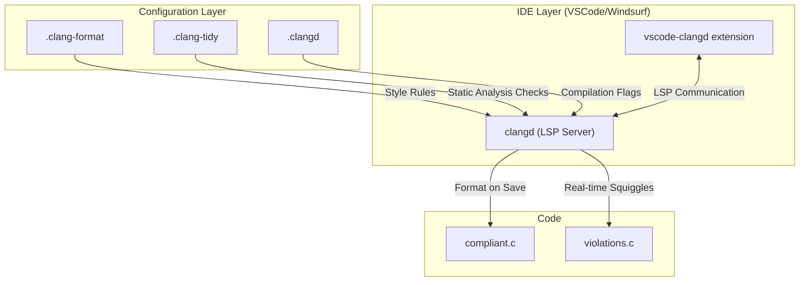
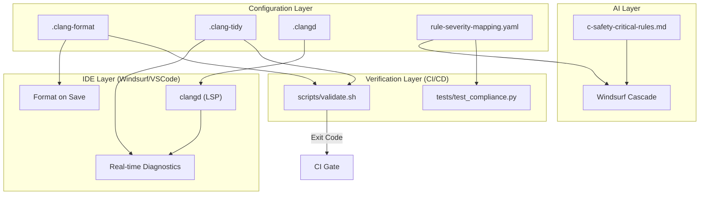
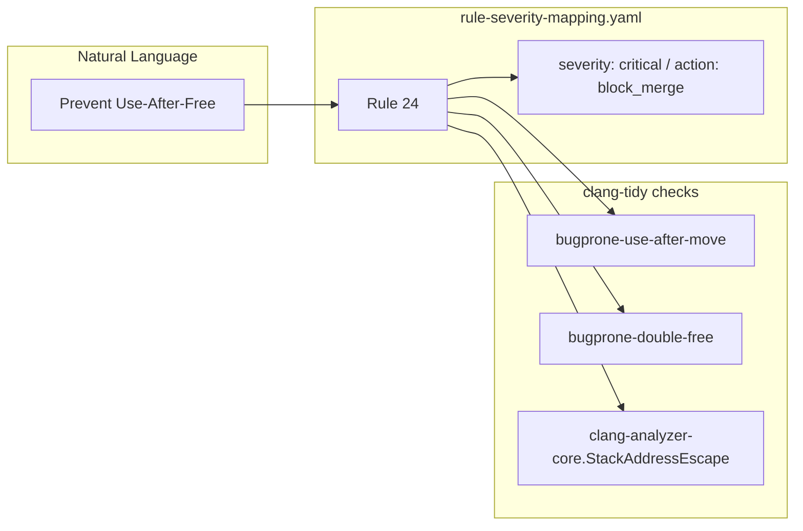
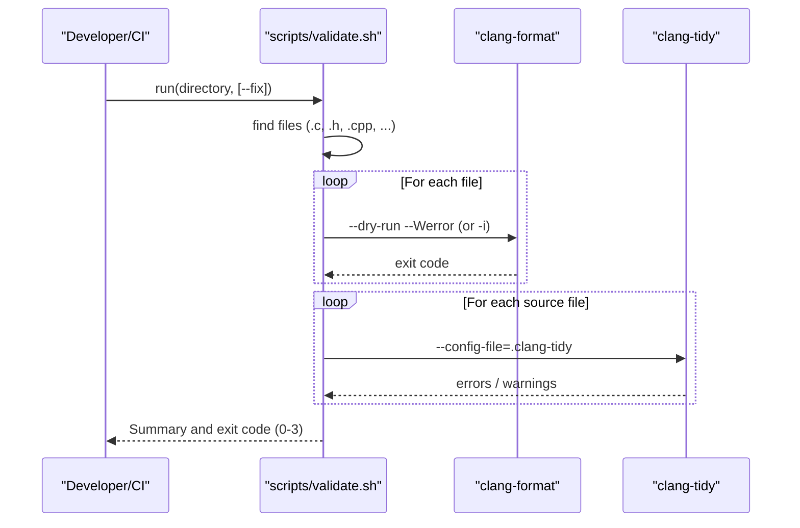

# C/C++ Code Standards Compliance Framework

> **Centralized clang-format, clang-tidy, and clangd configuration for safety-critical C/C++ development, with severity-based triage and Windsurf AI integration.**

[](https://opensource.org/licenses/MIT)

---

## Table of Contents

- [Overview](#overview)
- [The Three-Tool Pipeline](#the-three-tool-pipeline)
- [Framework Architecture](#framework-architecture)
- [Repository Structure](#repository-structure)
- [Getting Started](#getting-started)
- [Quick Start](#quick-start)
- [Validation Pipeline (validate.sh)](#validation-pipeline-validatesh)
- [Severity Classification](#severity-classification)
- [Rule Reference](#rule-reference)
- [Configuration Reference](#configuration-reference)
- [IDE Integration (clangd)](#ide-integration-clangd)
- [Windsurf AI Integration](#windsurf-ai-integration)
- [CI/CD Integration](#cicd-integration)
- [Automated Test Suite](#automated-test-suite)
- [Customization](#customization)
- [Requirements](#requirements)
- [Glossary](#glossary)
- [FAQ](#faq)
- [License](#license)
- [Support](#support)

---

## Overview

The C/C++ Code Standards Compliance Framework is a turnkey solution for enforcing safety-critical development standards. It turns ambiguous natural-language guidelines into a deterministic, tool-enforced pipeline built on the LLVM/Clang ecosystem.

Rather than spending hours researching the 300+ options exposed by clang-tidy and clang-format, teams copy a small set of pre-validated configuration files into their project and get:

- **Safety and security checks**: CERT C and MISRA-inspired rules that catch null dereferences, buffer overflows, use-after-free, resource leaks, and insecure API usage.
- **Deterministic enforcement**: the same code produces the same result in every developer environment and in CI/CD.
- **Severity-based triage**: every finding maps to a human-readable Rule ID and a Critical / Major / Minor tier that decides whether it blocks a merge, needs review, or is a warning.
- **Reduced review overhead**: formatting and mechanical bug detection are automated so human reviewers focus on logic and architecture.
- **AI-enhanced development**: Windsurf's Cascade assistant reads the framework's rule definitions to explain violations and suggest compliant fixes.

### Why Not Just Use the Tools Directly?

| Without This Framework | With This Framework |
|------------------------|---------------------|
| Research 300+ clang-tidy/clang-format options | Copy a few files and start validating |
| Every warning looks the same priority | Clear Critical / Major / Minor classification |
| Findings described with tool jargon | Findings referenced by Rule ID ("Rule 21 violation") |
| Hand-written CI/CD integration | Drop-in `validate.sh` with CI-friendly exit codes |
| Hope you enabled the right security checks | Pre-configured CERT C and security-focused checks |
| Generic AI assistance | AI that enforces your rules and proposes fixes |

### When to Use This

Use it when you are starting a new C/C++ project, adding static analysis to an existing codebase, working in a safety-critical domain (automotive, medical, aerospace, defense), or want AI-assisted review in Windsurf. Consider alternatives if your organization has existing incompatible standards, or if you need formal MISRA certification (this framework is MISRA-inspired, not certified).

---

## The Three-Tool Pipeline

The framework orchestrates three components of the LLVM toolchain. Think of them as spell-check, grammar-check, and an intelligent writing assistant for C/C++.

| Tool | Configuration | Role | When It Runs |
|------|---------------|------|--------------|
| **clang-format** | `.clang-format` | Styling: whitespace, brace placement, alignment | On save, via `validate.sh`, or manually |
| **clang-tidy** | `.clang-tidy` | Analysis: logical bugs, security risks, standard violations | In CI/CD, via `validate.sh`, or manually |
| **clangd** | `.clangd` | Language server: autocomplete, navigation, real-time diagnostics | Continuously inside the editor |

clangd acts as the hub inside the IDE: it consumes `.clang-format` for format-on-save and `.clang-tidy` for real-time diagnostics, and reads `.clangd` plus `compile_commands.json` to understand how the project is compiled.



---

## Framework Architecture

The framework is a closed-loop system with four layers that all operate on a single source of truth.

1. **Configuration Layer (the "What")**: `.clang-format`, `.clang-tidy`, `.clangd`, and `rule-severity-mapping.yaml` translate high-level safety standards into machine-readable tool configuration.
2. **IDE Layer (developer experience)**: clangd consumes the configuration to provide format-on-save and real-time diagnostics in Windsurf or VSCode, so violations are seen as they are typed rather than at CI time.
3. **AI Layer (intelligent remediation)**: Windsurf Cascade uses `windsurf/c-safety-critical-rules.md` to explain why a rule matters and to propose a compliant fix, prioritizing by severity tier.
4. **Verification Layer (the gatekeeper)**: `scripts/validate.sh` runs `clang-format --dry-run` and `clang-tidy` and returns CI-friendly exit codes; `tests/test_compliance.py` verifies the integrity of the framework itself.



### From Natural-Language Rule to Tool Check

Each safety requirement becomes a Rule ID in `rule-severity-mapping.yaml`, which is assigned a severity and mapped to one or more concrete clang-tidy checks. The same Rule ID is used in `windsurf/c-safety-critical-rules.md`, so the tooling, the AI assistant, and human reviewers all speak the same language.



### Development Workflow

1. Developer writes code; clangd shows real-time diagnostics and formats on save.
2. Optional pre-commit hook runs clang-format on staged files.
3. Developer commits and pushes.
4. CI runs `scripts/validate.sh` (clang-format and clang-tidy).
5. Windsurf Cascade (if used) explains violations by Rule ID and suggests fixes.
6. Findings are triaged as Critical (block), Major (review), or Minor (warn).
7. Code merges once all Critical issues are resolved.

---

## Repository Structure

```
.
├── README.md                      # This documentation
├── .clang-format                  # Formatting configuration (Allman braces, 4-space indent, 100 cols)
├── .clang-tidy                    # Static analysis checks, WarningsAsErrors, CheckOptions
├── .clangd                        # clangd language server configuration
├── .gitignore                     # Ignores build artifacts, compile_commands.json, .vscode/, Python caches
├── rule-severity-mapping.yaml     # Rule IDs -> severity tier -> clang-tidy checks
├── vscode-settings.json.template  # VSCode/Windsurf settings (clangd, format on save)
│
├── windsurf/
│   └── c-safety-critical-rules.md # Windsurf Cascade rule definitions
│
├── examples/
│   ├── compliant.c                # Reference implementation that passes all checks
│   └── violations.c               # Intentional violations, annotated by Rule ID
│
├── scripts/
│   ├── validate.sh                # Formatting + static analysis wrapper with CI exit codes
│   └── generate-compile-commands.sh # Generates compile_commands.json for clangd/clang-tidy
│
├── tests/
│   ├── __init__.py
│   └── test_compliance.py         # pytest suite verifying the framework's own integrity
│
└── docs/
    ├── rule-reference.md          # Detailed rule documentation with examples
    └── clangd-setup.md            # clangd setup and troubleshooting guide
```

| Path | Purpose |
|------|---------|
| Root configs (`.clang-format`, `.clang-tidy`, `.clangd`) | The source of truth consumed by every layer |
| `rule-severity-mapping.yaml` | Maps human-readable Rule IDs to severity tiers and clang-tidy checks |
| `scripts/` | `validate.sh` for local/CI validation; `generate-compile-commands.sh` for environment setup |
| `examples/` | `compliant.c` (gold standard) and `violations.c` (negative test cases) |
| `windsurf/` | AI-specific rule definitions for Windsurf Cascade |
| `tests/` | Python test suite ensuring configs are present, valid, and effective |
| `docs/` | Rule reference and clangd technical setup guide |

---

## Getting Started

### Prerequisites

1. **LLVM/Clang tools**: `clang-format`, `clang-tidy`, and (for IDE integration) `clangd`.
   - Ubuntu/Debian: `sudo apt-get install clang-format clang-tidy clangd`
   - macOS: `brew install llvm` and add the LLVM `bin` directory to your `PATH`
   - Windows: install LLVM from https://releases.llvm.org/ and check "Add LLVM to PATH"
2. **Bear** (optional): intercepts `make` to produce a compilation database when you do not use CMake.
3. **Python 3.8+**, `pytest`, and `PyYAML` (optional): required only to run the framework's own test suite.

### Step 1: Initialize Configuration

Copy the core configuration files into your project root. Tools discover them automatically:

- `.clang-format`: Allman-style brace wrapping and alignment rules
- `.clang-tidy`: static analysis checks and warnings promoted to errors
- `.clangd`: language server behavior
- `rule-severity-mapping.yaml`: Rule ID and severity definitions

### Step 2: Generate the Compilation Database

clangd and clang-tidy need `compile_commands.json` to resolve include paths and macro definitions:

```bash
./scripts/generate-compile-commands.sh [target_directory]
```

The script tries four methods in order:

1. **CMake**: if `CMakeLists.txt` exists, runs `cmake -DCMAKE_EXPORT_COMPILE_COMMANDS=ON`.
2. **Bear**: intercepts `make` to log compiler invocations.
3. **Manual crawl**: scans for `.c`/`.cpp` files and generates a heuristic entry for each.
4. **Template**: writes a minimal fallback `compile_commands.json` if no files are found.

### Step 3: Run the First Validation

```bash
# Check formatting and static analysis on a directory
./scripts/validate.sh examples/

# Auto-fix formatting only
./scripts/validate.sh examples/ --fix
```

To verify the installation, run `validate.sh` against `examples/compliant.c` (expected to pass) and `examples/violations.c` (expected to report Critical and Major findings).

---

## Quick Start

### Option A: Use as GitHub Template (New Projects)

1. Click **"Use this template"** on GitHub
2. Clone your new repository
3. Run `./scripts/generate-compile-commands.sh`
4. Start coding with standards already configured

### Option B: Add to Existing Project

```bash
# Clone this framework
git clone https://github.com/COG-GTM/-C-Code-Standards-Compliance-Framework.git

# Copy configs to your project
cp -C-Code-Standards-Compliance-Framework/.clang-format /path/to/your/project/
cp -C-Code-Standards-Compliance-Framework/.clang-tidy /path/to/your/project/
cp -C-Code-Standards-Compliance-Framework/.clangd /path/to/your/project/
cp -C-Code-Standards-Compliance-Framework/rule-severity-mapping.yaml /path/to/your/project/

# Copy the scripts
cp -r -C-Code-Standards-Compliance-Framework/scripts /path/to/your/project/

# (Optional) Copy Windsurf rules
mkdir -p /path/to/your/project/.windsurf/rules
cp -C-Code-Standards-Compliance-Framework/windsurf/c-safety-critical-rules.md \
   /path/to/your/project/.windsurf/rules/
```

### Option C: One-Line Install (curl)

```bash
# Run from your project root
curl -sL https://raw.githubusercontent.com/COG-GTM/-C-Code-Standards-Compliance-Framework/main/.clang-format -o .clang-format && \
curl -sL https://raw.githubusercontent.com/COG-GTM/-C-Code-Standards-Compliance-Framework/main/.clang-tidy -o .clang-tidy
```

### Verify Installation

```bash
# Check formatting (reports violations)
clang-format --dry-run --Werror src/*.c

# Run static analysis
clang-tidy src/*.c -- -I./include

# Or use the validation script
./scripts/validate.sh src/
```

---

## Validation Pipeline (validate.sh)

`scripts/validate.sh` is the primary entry point for the Verification Layer, for both local use and CI.

```
Usage: ./scripts/validate.sh [directory] [--fix]

  directory   Target directory to validate (default: current directory)
  --fix       Apply automatic fixes (formatting only)
```

### Exit Codes

| Exit Code | Meaning |
|-----------|---------|
| `0` | All checks passed |
| `1` | Format violations found |
| `2` | clang-tidy errors found |
| `3` | Both format and clang-tidy errors found |

### How It Works

1. **File discovery**: finds `.c`, `.cpp`, `.cc`, `.cxx`, `.h`, `.hpp`, and `.hxx` files, excluding `build/`, `.git/`, `third_party/`, and `vendor/`.
2. **Formatting stage**: runs `clang-format --dry-run --Werror` against the project's `.clang-format` (or `clang-format -i` when `--fix` is passed). Each non-conforming file increments the format error count.
3. **Static analysis stage**: runs `clang-tidy --config-file=.clang-tidy` on source files (headers are analyzed through their includes), adding `-I` flags for the target directory and project root. Output lines containing `error:` count as blocking issues; lines containing `warning:` are reported as "review recommended" but do not affect the exit code.
4. **Summary**: prints file counts and per-stage results, then exits with the code above.



Checks promoted to errors are controlled by `WarningsAsErrors` in `.clang-tidy`, which is how Critical rules end up blocking the pipeline.

---

## Severity Classification

Issues are classified into three severity levels defined in `rule-severity-mapping.yaml`:

| Severity | Rule ID Range | Action | Blocks Merge? | Examples |
|----------|---------------|--------|---------------|----------|
| **Critical** | Rule 20-29 | `block_merge` - must fix immediately | Yes | Null dereference, buffer overflow, use-after-free, unchecked return values |
| **Major** | Rule 30-39 | `require_review` - requires manual review | Recommended | Narrowing conversions, redundant code, thread safety |
| **Minor** | Rule 40-49 | `warn_only` - fix when convenient | No | Formatting, naming conventions, style preferences |

### Why Severity Matters

- **Critical** issues are potential crashes, security vulnerabilities, or data corruption.
- **Major** issues may cause bugs in edge cases or reduce maintainability.
- **Minor** issues affect readability but not functionality.

---

## Rule Reference

Each rule maps to one or more clang-tidy checks in `rule-severity-mapping.yaml` and is documented with compliant and non-compliant examples in `docs/rule-reference.md`.

### Critical Rules (Block Merge)

| Rule ID | Name | Description |
|---------|------|-------------|
| Rule 20 | Check all return values | Return values from fallible functions (see `CheckedFunctions`) must be checked |
| Rule 21 | Prevent buffer overflows | Use bounded string functions, validate array indices |
| Rule 22 | Prevent null pointer dereference | Validate all pointers before use |
| Rule 23 | Prevent resource leaks | Free all allocated memory, close all handles |
| Rule 24 | Prevent use-after-free | Never access memory after freeing |
| Rule 25 | Prevent uninitialized memory access | Initialize all variables before use |
| Rule 26 | Avoid security vulnerabilities | Avoid insecure APIs (`rand`, `strcpy`, etc.) |

### Major Rules (Require Review)

| Rule ID | Name | Description |
|---------|------|-------------|
| Rule 30 | Avoid narrowing conversions | Check overflow before casting to smaller types |
| Rule 31 | Consistent parameter names | Declaration and definition names must match |
| Rule 32 | Avoid redundant code | Remove duplicate or unreachable code |
| Rule 33 | Prevent infinite loops | Avoid loops that cannot terminate |
| Rule 34 | Thread safety | Use thread-safe functions in multi-threaded code |
| Rule 35 | Performance issues | Avoid unnecessary copies and allocations |

### Minor Rules (Warn Only)

| Rule ID | Name | Description |
|---------|------|-------------|
| Rule 40 | Consistent formatting | Allman brace placement enforced by `.clang-format` |
| Rule 41 | Naming conventions | Consistent identifier naming |
| Rule 42 | Always use braces | Braces around all control-flow blocks |
| Rule 43 | Simplify boolean expressions | Remove redundant boolean logic |
| Rule 44 | Avoid else after return | Remove unnecessary `else` after `return` |
| Rule 45 | Use nullptr (C++) | Prefer `nullptr` over `NULL` |
| Rule 46 | Remove unused parameters | Remove or annotate unused parameters |

---

## Configuration Reference

### `.clang-format`

Defines the lexical style. Key settings:

- `BreakBeforeBraces: Custom` with every brace type wrapped (Allman style)
- `IndentWidth: 4`, `ContinuationIndentWidth: 4`
- `ColumnLimit: 100`
- `PointerAlignment: Right`, `DerivePointerAlignment: false`

### `.clang-tidy`

Defines static analysis behavior:

- `Checks`: enabled check families (`bugprone-*`, `cert-*`, `clang-analyzer-*`, `misc-*`, `performance-*`, `readability-*`, and others)
- `WarningsAsErrors`: the subset of checks promoted to errors, which is what makes Critical rules block `validate.sh`
- `CheckOptions`: per-check tuning such as `bugprone-unused-return-value.CheckedFunctions` (the C library functions whose return values must be checked) and `readability-identifier-naming.*`
- `HeaderFilterRegex`: which headers are analyzed

### `.clangd`

Configures the language server:

- `CompileFlags`: flags added/removed for analysis
- `Diagnostics.ClangTidy`: checks added/removed for real-time diagnostics, plus `UnusedIncludes: Strict`
- `Index.Background: Build`: project-wide background indexing for navigation
- `Completion.AllScopes` and `InlayHints` (parameter names, deduced types, designators)
- `Hover.ShowAKA`

### `rule-severity-mapping.yaml`

The bridge between tool output and human-readable rules. Each severity tier has an `action` (`block_merge`, `require_review`, `warn_only`) and a list of rules; each rule has a `rule_id`, `name`, `description`, and `checks` list. A `suppression` section documents the standard `NOLINT` syntax.

---

## IDE Integration (clangd)

Full clangd support is included for Windsurf, VSCode, and other LSP-capable editors. You need three things: the clangd binary, the clangd editor extension, and this framework's configuration.

### Step 1: Install clangd

**macOS (Homebrew):**
```bash
brew install llvm
echo 'export PATH="/opt/homebrew/opt/llvm/bin:$PATH"' >> ~/.zshrc
source ~/.zshrc
clangd --version
```

**Ubuntu/Debian:**
```bash
sudo apt-get update
sudo apt-get install clangd
clangd --version
```

**Windows:** download LLVM from https://releases.llvm.org/, run the installer, check "Add LLVM to PATH", and verify with `clangd --version`.

### Step 2: Install the clangd Extension

1. Open Extensions in Windsurf/VSCode (Ctrl+Shift+X, or Cmd+Shift+X on macOS)
2. Search for **clangd** and install the extension by **llvm-vs-code-extensions**
3. If prompted, disable Microsoft's C/C++ IntelliSense (it conflicts with clangd)

### Step 3: Configure Your Editor

```bash
mkdir -p .vscode
cp vscode-settings.json.template .vscode/settings.json
```

The template:

- Disables `C_Cpp.intelliSenseEngine` so it does not conflict with clangd
- Passes `--clang-tidy` to clangd so safety violations appear as real-time squiggles
- Enables format-on-save for `[c]` and `[cpp]` using `llvm-vs-code-extensions.vscode-clangd` as the default formatter

### Step 4: Generate `compile_commands.json`

```bash
./scripts/generate-compile-commands.sh
```

Without a compilation database, clangd may report "file not found" for standard headers. `compile_commands.json` is git-ignored, so regenerate it per checkout.

### Verify

You should see autocomplete suggestions, working go-to-definition, real-time error squiggles, and hover documentation. If not, see [docs/clangd-setup.md](docs/clangd-setup.md) for troubleshooting.

---

## Windsurf AI Integration

When the rules file is present, Windsurf's Cascade assistant will:

1. Detect violations as you write
2. Classify them by severity (Critical, Major, Minor)
3. Report them with rule numbers (e.g., "Rule 20 violation: unchecked return value")
4. Explain why the rule matters
5. Suggest fixes using compliant code patterns

### Setup

```bash
mkdir -p .windsurf/rules
cp windsurf/c-safety-critical-rules.md .windsurf/rules/
```

Open the project in Windsurf and Cascade will enforce the rules automatically.

### Example Interaction

```
User: Review this function

Cascade: I found 2 issues:

Critical - Rule 20 violation: Return value of `fopen` is not checked.
   Line 5: `FILE *f = fopen("data.txt", "r");`
   Fix: Add null check before using the file handle.

Major - Rule 30 violation: Narrowing conversion from `size_t` to `int`.
   Line 12: `int count = bytes_read;`
   Fix: Check for overflow or use appropriate type.
```

---

## CI/CD Integration

### GitHub Actions

Create `.github/workflows/code-standards.yml`:

```yaml
name: Code Standards

on:
  push:
    branches: [main, develop]
  pull_request:
    branches: [main, develop]

jobs:
  lint:
    runs-on: ubuntu-latest
    steps:
      - uses: actions/checkout@v4

      - name: Install clang tools
        run: |
          sudo apt-get update
          sudo apt-get install -y clang-format clang-tidy

      - name: Validate code standards
        run: ./scripts/validate.sh src/
```

### GitLab CI

Create `.gitlab-ci.yml`:

```yaml
code-standards:
  image: ubuntu:22.04
  before_script:
    - apt-get update && apt-get install -y clang-format clang-tidy
  script:
    - ./scripts/validate.sh src/
```

### Pre-commit Hook

Create `.git/hooks/pre-commit`:

```bash
#!/bin/bash
# Auto-format staged C files before commit

STAGED_FILES=$(git diff --cached --name-only --diff-filter=ACM | grep -E '\.(c|cpp|h|hpp)$')

if [ -n "$STAGED_FILES" ]; then
    echo "Formatting staged C/C++ files..."
    echo "$STAGED_FILES" | xargs clang-format -i
    echo "$STAGED_FILES" | xargs git add
fi
```

---

## Automated Test Suite

`tests/test_compliance.py` is a pytest suite that verifies the framework itself. Tests that shell out to `clang-format` or `clang-tidy` are skipped automatically when those tools are not installed.

```bash
pip install pytest pyyaml
pytest tests/test_compliance.py -v
```

| Test Class | What It Verifies |
|------------|------------------|
| `TestConfigurationFiles` | `.clang-format`, `.clang-tidy`, `rule-severity-mapping.yaml`, and the Windsurf rules exist; `validate.sh` exists and is executable |
| `TestClangFormat` | `.clang-format` is accepted by `clang-format --dump-config`, contains `IndentWidth`, `BreakBeforeBraces`, and `PointerAlignment`, and `examples/compliant.c` passes a dry run |
| `TestClangTidy` | `.clang-tidy` is valid (`--list-checks`) and analyzing `examples/violations.c` produces at least one warning or error |
| `TestSeverityMapping` | All three severity tiers exist, Critical has rules, every rule has checks, Rule IDs are unique and Critical rules start at Rule 20 |
| `TestExampleFiles` | Both examples exist, `compliant.c` has `main`, `violations.c` documents its Rule IDs |
| `TestDocumentation` | README and `docs/rule-reference.md` exist and README documents Quick Start and severity levels |

Note: `.clang-tidy` uses the `SystemHeaders` key, which older clang-tidy releases (e.g. 14) do not recognize; on those versions `TestClangTidy::test_config_is_valid` fails. Use a newer LLVM release for a clean run.

---

## Customization

### Adjusting Severity

Edit `rule-severity-mapping.yaml` to move rules between the Critical, Major, and Minor tiers or to change which checks a rule covers. To change what actually blocks `validate.sh`, update `WarningsAsErrors` in `.clang-tidy` to match.

### Adding/Removing Checks

Edit `.clang-tidy`:

```yaml
Checks: >
  bugprone-*,
  cert-*,
  -bugprone-easily-swappable-parameters,  # Disable this check
  misc-my-custom-check,                    # Add this check
```

### Project-Specific Options

```yaml
CheckOptions:
  - key: readability-identifier-naming.FunctionCase
    value: camelCase  # Or lower_case, CamelCase, etc.
```

### Suppressing Warnings

```c
// Single line
malloc(size);  // NOLINT(clang-analyzer-unix.Malloc)

// Block
// NOLINTBEGIN(bugprone-unused-return-value)
legacy_function_call();
// NOLINTEND(bugprone-unused-return-value)

// Whole file (add at top)
// NOLINTFILE(check-name)
```

---

## Requirements

### Required Tools

| Tool | Minimum Version | Purpose |
|------|-----------------|---------|
| clang-format | 14.0+ | Code formatting |
| clang-tidy | 14.0+ (newer recommended, see test suite note) | Static analysis |

### Optional Tools

| Tool | Purpose |
|------|---------|
| clangd | IDE integration (language server) |
| Bear | Generating `compile_commands.json` for Make-based projects |
| Python 3.8+, pytest, PyYAML | Running the framework's test suite |

### Supported Environments

| Environment | Support |
|-------------|---------|
| Linux, macOS, Windows | Full support with LLVM/Clang installed |
| CI/CD | GitHub Actions, GitLab CI, Jenkins, etc. |
| IDEs | Windsurf, VSCode, CLion, Vim (via clangd) |

---

## Glossary

| Term | Definition |
|------|------------|
| **Rule ID (Rule 20-49)** | Human-readable identifier in `rule-severity-mapping.yaml` that groups one or more clang-tidy checks. Critical rules are 20-29, Major 30-39, Minor 40-49. |
| **Critical / Major / Minor** | The three severity tiers, with actions `block_merge`, `require_review`, and `warn_only` respectively. |
| **Block Merge** | The CI/CD gate triggered by Critical findings; implemented via `WarningsAsErrors` and `validate.sh` exit codes. |
| **Allman Style** | Brace placement with every opening brace on its own line; the mandatory formatting standard in `.clang-format`. |
| **Compilation Database** | `compile_commands.json`, which tells clangd and clang-tidy how each file is compiled (include paths, defines). Generated by `scripts/generate-compile-commands.sh`. |
| **Goto Cleanup Pattern** | Single-exit resource management using a `cleanup:` label so all resources are released on every path (Rule 23). Demonstrated in `examples/compliant.c`. |
| **Post-Free Scrubbing** | Setting a pointer to `NULL` immediately after `free()` to prevent use-after-free and double-free (Rule 24). |
| **Narrowing Conversion** | Casting to a type that cannot represent all source values (e.g., `size_t` to `int`); flagged by Rule 30 via `bugprone-narrowing-conversions`. |
| **Insecure APIs** | Banned standard functions such as `strcpy`, `sprintf`, `gets`, and `rand` (Rule 26). |
| **`WarningsAsErrors`** | `.clang-tidy` list that promotes checks to errors, causing `validate.sh` to exit non-zero. |
| **`CheckedFunctions`** | Option for `bugprone-unused-return-value` listing the C library functions whose return values must be checked (Rule 20). |
| **`HeaderFilterRegex`** | `.clang-tidy` setting controlling which headers are analyzed. |
| **NOLINT** | Standardized suppression syntax (`NOLINT`, `NOLINTNEXTLINE`, `NOLINTBEGIN`/`NOLINTEND`) for intentional, documented violations. |
| **Background Indexing** | clangd feature (`Index.Background: Build`) that indexes the whole project for symbol navigation. |
| **Inlay Hints** | Inline editor annotations for parameter names and deduced types, enabled in `.clangd`. |
| **Cascade Rules** | The Windsurf AI rule file (`windsurf/c-safety-critical-rules.md`) that drives automated explanation and remediation. |

---

## FAQ

### Q: Does this replace manual code review?

**A:** No. It automates the mechanical parts of code review (formatting, common bugs) so human reviewers can focus on architecture, logic, and domain-specific concerns.

### Q: Is this MISRA certified?

**A:** No. This is MISRA-inspired but not formally certified. For formal MISRA compliance, use a certified tool like Polyspace or PC-lint.

### Q: Can I use this with CMake?

**A:** Yes. Add `set(CMAKE_EXPORT_COMPILE_COMMANDS ON)` to your `CMakeLists.txt`, or let `scripts/generate-compile-commands.sh` detect CMake and do it for you. Then run clang-tidy with `--config-file=.clang-tidy -p build/`.

### Q: How do I set up clangd for IDE integration?

**A:** Generate `compile_commands.json` with `./scripts/generate-compile-commands.sh`, copy `vscode-settings.json.template` to `.vscode/settings.json`, and see `docs/clangd-setup.md` for details.

### Q: How do I handle legacy code with many violations?

**A:** Fix violations incrementally (start with Critical only), use `// NOLINT` to suppress known violations in legacy files, or use `HeaderFilterRegex` in `.clang-tidy` to limit analysis to new code.

### Q: Can I contribute new rules?

**A:** Yes. Open a pull request with a rule description, compliant and non-compliant examples, and the mapping to clang-tidy checks in `rule-severity-mapping.yaml`.

---

## License

MIT License - Free for use in any project, commercial or open source.

---

## Support

- **Issues:** https://github.com/COG-GTM/-C-Code-Standards-Compliance-Framework/issues
- **Discussions:** https://github.com/COG-GTM/-C-Code-Standards-Compliance-Framework/discussions
